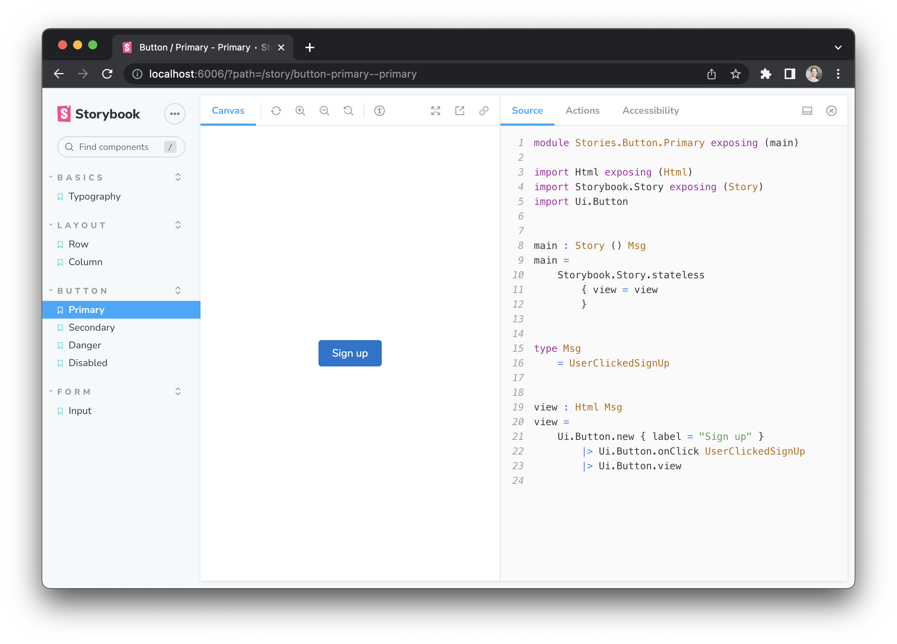

# elm-storybook-example
> An example for how you can use [Storybook](https://storybook.js.org) to build your next design system in [Elm](https://elm-lang.org)!



## Try it out

__Note:__ This project requires [Node.js v16+](https://nodejs.org) (because it is powered by Vite 3.x)

```
npm start
```

## Features

- 🌳  Write your component examples in `.elm` files
- ❗️  See helpful compiler errors in browser (powered by [Vite](https://vitejs.dev)!)
- 📄  View the full Elm source code (in the "Source" tab)
- 🪵  Automatically log Elm messages (in the "Actions" tab)
- ♿️  Get accessibility feedback (in the "Accessibility" tab)
- ↕️  Define the order of stories (in `.storybook/preview.js`)
- 🎨  Import custom CSS files (in `.storybook/preview.js`)


## How it works

When you create an Elm module in `src/Stories`, the custom Storybook plugin will automatically add it to your Storybook.


For example, try creating a new file at `./src/Stories/HelloWorld.elm` with the following content:

```elm
module Stories.HelloWorld exposing (main)

import Html exposing (Html)
import Storybook.Story exposing (Story)


main : Story () msg
main =
    Storybook.Story.stateless
        { view = view
        }


view : Html msg
view =
    Html.text "Hello, world!"

```

Just like in a standard Storybook project, your `.storybook/preview.js` will allow you to import custom JS or CSS files for use in your project.

This file also lets you define the order that you want your stories to appear in the left sidebar.

Any edits to the `./static/style.css` will automatically show up in your browser– thanks to the work done by the folks in the Storybook + Vite communities ❤️
